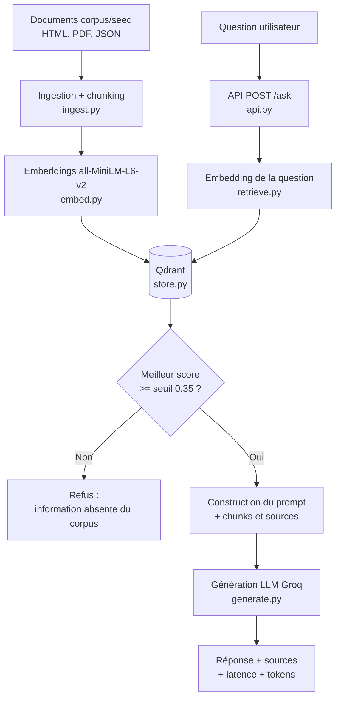
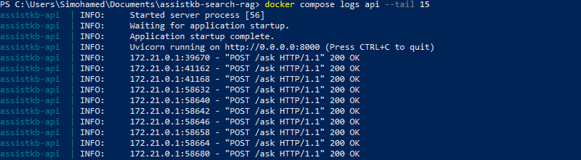
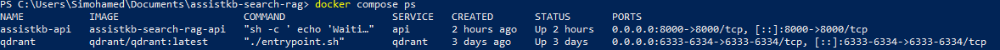
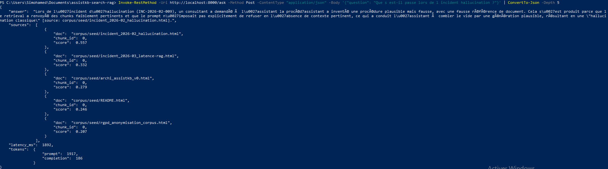
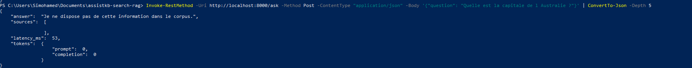
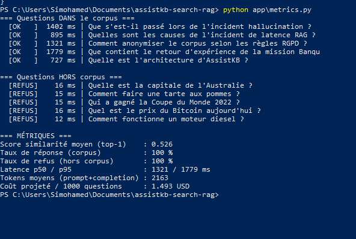

# Compte rendu — Projet A : AssistKB Search (RAG)

**Membres :** Mohamed Bouyabri, Celia Merabet
**Dépôt :** https://github.com/celia-merabet/assistkb-search-rag

---

## 1. Objectif du projet

AssistKB Search est un assistant de recherche basé sur une architecture RAG
(Retrieval-Augmented Generation). Il répond aux questions des utilisateurs en
s'appuyant sur une base de connaissances interne, et il :

- interroge un corpus documentaire hétérogène (HTML, PDF, JSON) ;
- retrouve les passages pertinents par recherche vectorielle (Qdrant) ;
- génère une réponse en langage naturel à partir des documents retrouvés ;
- cite systématiquement les sources utilisées ;
- refuse de répondre lorsque l'information n'est pas présente dans le corpus.

Le système simule un assistant interne de type base de connaissances pour une
ESN, limitant les hallucinations grâce à un seuil de similarité qui bloque les
questions hors périmètre avant tout appel au modèle de génération.

---

## 2. Répartition des tâches

**Celia Merabet — Data / Ingestion (R1 + R2)**
Préparation et indexation des données : extraction du contenu du corpus,
nettoyage et structuration, découpage en chunks avec métadonnées, génération des
embeddings, stockage des vecteurs dans Qdrant, cohérence de l'index.
Fichiers : `app/ingest.py`, `app/embed.py`, `app/store.py`.

**Mohamed Bouyabri — Retrieval / LLM / API (R3 + R4)**
Moteur de recherche et exposition du service : recherche vectorielle top-k,
seuil de similarité pour le refus, construction du prompt avec citation des
sources, génération via le LLM, API FastAPI `/ask`, module de métriques,
corrections de déploiement Docker.
Fichiers : `app/retrieve.py`, `app/generate.py`, `app/api.py`, `app/metrics.py`,
`docker-compose.yml`, `Dockerfile`.

Le travail a été mené en collaboration sur la branche `r3-retrieval`, chaque
membre committant son propre périmètre.

---

## 3. Architecture du système

Le pipeline suit une architecture RAG classique :

---

## 4. Fonctionnement global

Lorsqu'un utilisateur pose une question :

1. l'API reçoit la requête sur `POST /ask` (corps JSON `{"question": "..."}`) ;
2. la question est transformée en embedding (all-MiniLM-L6-v2) ;
3. Qdrant retourne les chunks les plus proches (top-k = 5, distance cosinus) ;
4. **si le meilleur score de similarité est inférieur au seuil de 0.35, le
   système refuse de répondre immédiatement**, sans appeler le LLM ;
5. sinon, les chunks retrouvés et leurs sources sont injectés dans le prompt ;
6. le LLM (Groq) génère une réponse citant les sources ;
7. l'API renvoie la réponse, les sources (document, chunk, score), la latence
   et le nombre de tokens consommés.

Le seuil de 0.35 constitue le garde-fou anti-hallucination : il garantit que le
modèle ne « comble pas le vide » quand aucun document pertinent n'est trouvé.

---

## 5. Stack technique

| Composant | Technologie |
|---|---|
| Vector store | Qdrant |
| Embeddings | sentence-transformers (all-MiniLM-L6-v2) |
| API | FastAPI |
| LLM | Groq (llama-3.3-70b-versatile, free tier) |
| Conteneurisation | Docker + Docker Compose |
| Parsing documents | BeautifulSoup, PyPDF, lxml |

---

## 6. Choix techniques justifiés

| Choix | Valeur | Justification |
|---|---|---|
| Modèle d'embeddings | all-MiniLM-L6-v2 | léger (384 dimensions), s'exécute sur CPU sans GPU, gratuit, performances correctes en français |
| Vector store | Qdrant | imposé pour le projet A ; API simple, payload riche permettant de stocker et restituer les sources |
| Distance | Cosinus | embeddings normalisés ; standard pour la similarité sémantique |
| top-k | 5 | compromis entre richesse du contexte et bruit |
| Seuil de similarité | 0.35 | en dessous, les chunks ne traitent pas réellement la question ; validé empiriquement (questions hors corpus à scores ~0.2-0.3, questions pertinentes > 0.5) |
| LLM | Groq llama-3.3-70b | free tier, latence faible, qualité suffisante en français |
| IDs Qdrant | déterministes (uuid5) | évite la duplication des vecteurs lors des ré-indexations successives |

---

## 7. Résultats et métriques

Métriques mesurées via `app/metrics.py` sur un jeu de 5 questions présentes dans
le corpus et 5 questions hors corpus.

| Métrique | Valeur |
|---|---|
| Score de similarité moyen (top-1) | 0.526 |
| Taux de réponse (questions du corpus) | 100 % |
| Taux de refus (questions hors corpus) | 100 % |
| Latence p50 / p95 | 1115 / 1565 ms |
| Tokens moyens (prompt + completion) | 2182 |
| Coût projeté / 1000 questions | ~1,50 USD |

Les taux de réponse (100 %) et de refus (100 %) confirment que le seuil de 0.35
sépare correctement les questions couvertes par le corpus de celles hors
périmètre. L'écart de latence entre une réponse (~1 100 ms) et un refus
(~15 ms) montre que le refus s'effectue avant tout appel au LLM, ce qui le rend
instantané et gratuit en tokens.

### Captures des tests

**Démarrage automatique de la stack**

**Conteneurs actifs**

**Question présente dans le corpus (réponse avec sources)**

Le document pertinent ressort nettement en tête (score le plus élevé), les
documents hors sujet restent sous le seuil de 0.35.

**Question hors corpus (refus)**

Le refus intervient en quelques millisecondes, sans appel au LLM (0 token
consommé).

**Métriques mesurées via `app/metrics.py`**

---

## 8. Difficultés rencontrées et limites

**Difficultés rencontrées**

- **Build Docker** : échecs répétés par timeout réseau lors du téléchargement de
  PyTorch (~532 Mo). Résolu en utilisant la version CPU de torch (~190 Mo) et en
  découpant le Dockerfile en couches mises en cache.
- **Communication API ↔ Qdrant** : remplacement de `localhost` par le nom de
  service `qdrant` pour que les conteneurs communiquent dans le réseau Docker.
- **Lancement de l'indexation automatique** : correction du script de démarrage
  (`python -m scripts.index`) pour résoudre un `ModuleNotFoundError`.
- **Duplication des vecteurs** : passage à des identifiants déterministes (uuid5)
  pour éviter les doublons à chaque ré-indexation.

**Limites actuelles**

- Corpus volontairement réduit (corpus seed), à enrichir via `fetch_corpus`.
- Chunking par mots à affiner (un chunk par document sur le corpus actuel).
- Le seuil filtre le hors-sujet total, mais des documents moyennement proches
  peuvent encore remonter ; un reranking améliorerait la précision.

---

## 9. Licences des corpus

Le corpus seed est constitué de documents internes simulés créés pour le projet.
Le corpus additionnel récupérable via `scripts/fetch_corpus.sh` provient de
sources publiques sous licences ouvertes (data.gouv.fr).
